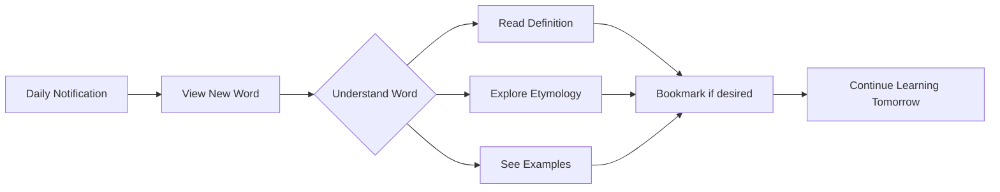

# LinguaDaily - Expand Your Vocabulary Daily

📱 **Available on Google Play Store** | 🌐 **Multilingual Learning** | 📚 **One Word at a Time**

[](https://play.google.com/store/apps/details?id=com.linguadaily.app)


## 🌟 About LinguaDaily

LinguaDaily is your perfect companion for multilingual learning and vocabulary expansion. Receive a fresh word every day across one or more languages of your choice, making language learning effortless and consistent.


## ✨ Key Features

### 📖 Daily Word Delivery
- **One word per language daily** - Perfect for busy learners
- **Multiple language support** - Learn Spanish, French, Japanese, and more simultaneously
- **Consistent learning habit** - Build vocabulary gradually and effectively

### 🎯 Rich Word Context
- **Clear definitions** - Understand each word thoroughly
- **Etymology insights** - Learn about word origins and history
- **Example sentences** - See words used in real-world contexts
- **Bookmark system** - Save favorite words for later review

### 📱 Smart Technology
- **Hybrid architecture** - Server-tracked progress with local caching
- **Offline support** - Learn without internet connection
- **Sync across devices** - Progress saved with unique user ID
- **No duplicates** - Advanced algorithm ensures you never see repeated words

## 🚀 How It Works

### Installation & Setup
1. **Download** from Google Play Store
2. **Select languages** - Choose one or multiple languages to learn
3. **Receive daily words** - Get a new word every day for each selected language

### Learning Flow


## 🛠 Technical Architecture

### Hybrid Model (Server + Local)
- **Centralized Database** - Stores all approved words with unique ordering
- **User Progress Tracking** - Server maintains learning history
- **Local Cache** - Stores ~300 words for offline use
- **Smart Sync** - Ensures seamless experience across devices

### Data Flow
```
Server (All Words + User Progress) → Local Cache (300 words) → Daily Notifications
```

## 📊 App Information

- **Version:** 1.0.11
- **Updated:** June 7, 2025
- **Requires Android:** 10 and up
- **Downloads:** 10+ (Growing daily!)
- **Content Rating:** PEGI 3
- **Offered by:** Google Commerce Ltd

## 💡 Why Choose LinguaDaily?

### ✅ Advantages Over Traditional Apps
- **No lost progress** - User account system preserves learning history
- **Personalized experience** - Backend enables future features like difficulty levels
- **Scalable architecture** - Ready for new languages and features
- **Efficient networking** - Minimal data usage with smart batch loading

### 🎯 Perfect For
- **Polyglots** learning multiple languages
- **Travelers** preparing for trips abroad
- **Students** expanding their vocabulary
- **Language enthusiasts** exploring etymology
- **Busy professionals** wanting consistent micro-learning

## 🔄 Version History

**v1.0.11** (June 7, 2025)
- Improved word delivery system
- Enhanced offline support
- Bug fixes and performance improvements

**v1.0.0** (May 21, 2025)
- Initial release
- Multi-language support
- Basic word learning features

## 📱 Permissions

LinguaDaily requires minimal permissions to provide the best experience:
- Internet access (for word updates)
- Notifications (for daily reminders)
- Storage (for offline word caching)

## 🌍 Supported Languages

*Currently includes:* Spanish, French, Japanese, German, Italian, Portuguese, and more being added regularly!

## 💬 Support

Having issues or suggestions? We'd love to hear from you!
- Rate us on Google Play
- Send feedback through the app
- Report bugs for quick fixes

## 📄 License

Free to use with optional ad-supported model. Your support through ads helps us continue developing and adding new languages!

---

**Start your language journey today!** 📚✨

[](https://play.google.com/store/apps/details?id=com.linguadaily.app)

*"A word a day opens up a world of understanding."* 🌍
